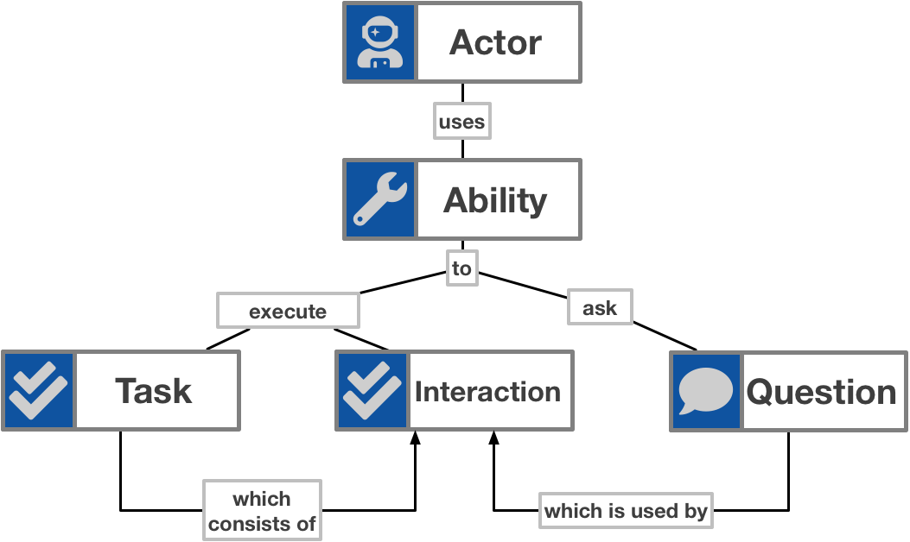

# Working Principles

## Overview



## Actor

An Acto

## Ability

## Interactions

Interactions are the basic elements provided by an ability.
 e.g.
 - [`Sleep`](docs/features/interactions/general/SLEEP.md) for an amount of time
 - [`Click`](docs/features/interactions/web/CLICK.md) on an element
 - [`Enter`](docs/features/interactions/web/ENTER.md) a text into a text field or area
 - [`See`](docs/features/interactions/general/SEE.md) if a `Question` matches a specified state
 - [`Post`](docs/features/interactions/rest/POST.md) a rest request
 
 There are interactions which execute user actions on an device like `Click` or `Enter`
 and there are interactions which query the status of an device like `See`.
 
 ## Tasks
 
 Tasks are the building blocks of work flows and consists of:
 - [interactions](basics/INTERACTIONS.md) and
 - tasks
 
  for example:
  ```typescript
 const logan: Actor = Actor.named(`Logan`);
 
 logan.attemptsTo(
     See.if(Text.of(MY_ELEMENT))
         .is(Expected.toBe(`the text of the element`))
 )
 ```
 
 ## Questions
 
 a question retrieves the state of a device attribute or element.
 `Text` for example is a Question which retrieves the text of a web element. 
 Just by itself a Question does not make sense.
 It is always used in combination with an Interaction like `See`, which uses the Question to check if a condition is met.
 
> See section 
> - [`Questions`](basics/QUESTIONS.md) and
> - [`See` Interaction](docs/features/interactions/general/SEE.md) 
 
for example:
 ```typescript
const logan: Actor = Actor.named(`Logan`);

logan.attemptsTo(
    See.if(Text.of(MY_ELEMENT))
        .is(Expected.toBe(`the text of the element`))
)
```